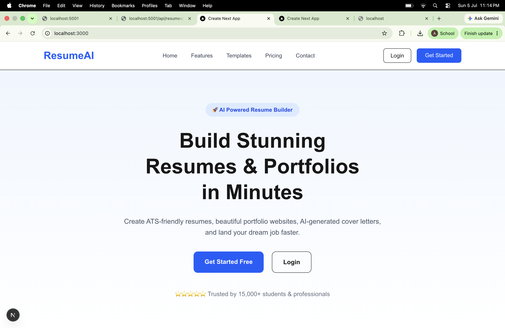
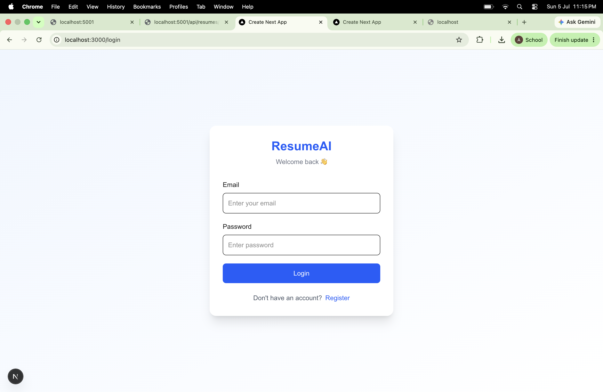
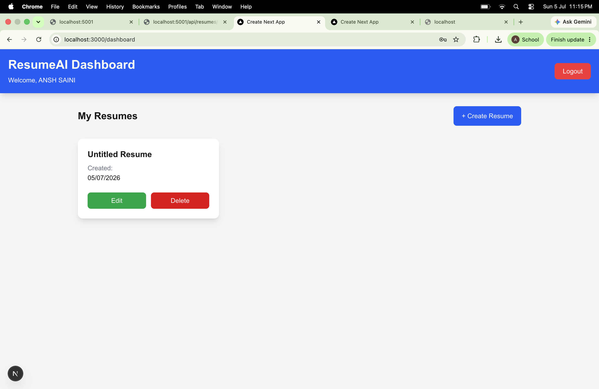
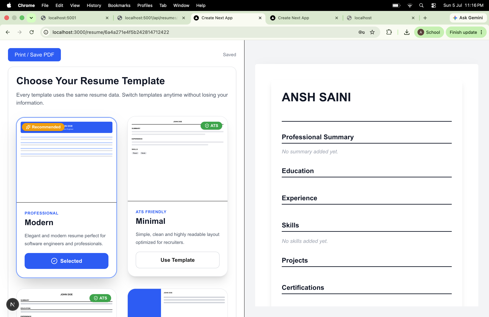
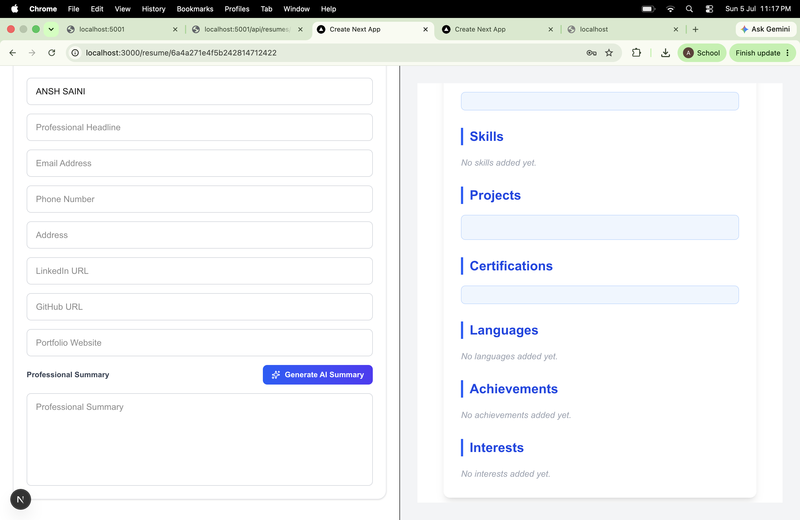

# 🚀 ResumeAI - AI Resume & Portfolio Builder

<div align="center">


**Build Professional ATS-Friendly Resumes with AI**

</div>

---
## 🔗 Live Links

- 🚀 **Live Application:** https://resume-m5fkhvd3i-ansh-s-projects.vercel.app
- 🌍 **Alternate Deployment:** https://resume-ai-alpha-beige.vercel.app
- ⚙️ **Backend API:** https://resumeai-qfs2.onrender.com
- 📂 **GitHub Repository:** https://github.com/sainiansh3004/ResumeAI

---

## 📖 Overview

ResumeAI is a modern full-stack AI-powered Resume & Portfolio Builder that helps users create professional resumes in minutes.

The application provides real-time editing, AI-generated professional summaries, multiple ATS-friendly templates, PDF export, authentication, and an intuitive dashboard to manage resumes.

---

# ✨ Features

### 🔐 Authentication

- User Registration
- Secure Login
- JWT Authentication
- Protected Routes
- Password Encryption using bcrypt

---

### 📝 Resume Builder

Create resumes with sections including:

- Personal Information
- Education
- Experience
- Skills
- Projects
- Certifications
- Achievements
- Languages
- Interests

---

### 🤖 AI Features

- AI Resume Summary Generation
- Google Gemini AI Integration
- One-click Professional Summary

---

### 🎨 Resume Templates

- Modern Template
- ATS Template
- Minimal Template
- Creative Template

---

### ⚡ Live Editing

- Live Resume Preview
- Auto Save
- Responsive Design
- Professional Layout
- Theme Customization

---

### 📄 Export

- High Quality PDF Export
- Print Friendly Layout
- ATS Compatible Resume

---

# 🛠 Tech Stack

## Frontend

- Next.js 16
- React
- TypeScript
- Tailwind CSS
- Axios

## Backend

- Node.js
- Express.js
- MongoDB Atlas
- Mongoose
- JWT Authentication
- bcrypt
- Google Gemini AI

## Tools

- Git
- GitHub
- Postman
- Render
- Vercel

---

# 📂 Folder Structure

```
ResumeAI
│
├── client
│   ├── app
│   ├── components
│   ├── services
│   ├── public
│   └── types
│
├── server
│   ├── src
│   │
│   ├── config
│   ├── controllers
│   ├── middleware
│   ├── models
│   ├── routes
│   └── services
│
└── README.md
```

---

# 🚀 Installation

## Clone Repository

```bash
git clone https://github.com/sainiansh3004/ResumeAI.git
```

```bash
cd ResumeAI
```

---

# Backend Setup

```bash
cd server
npm install
```

Create a `.env` file:

```env
PORT=5001

MONGODB_URI=YOUR_MONGODB_URI

JWT_SECRET=YOUR_SECRET

GEMINI_API_KEY=YOUR_GEMINI_API_KEY
```

Run Backend

```bash
npm run dev
```

---

# Frontend Setup

```bash
cd client
npm install
```

Run Frontend

```bash
npm run dev
```

Visit

```
http://localhost:3000
```

---

# 📸 Screenshots

## Landing Page



---

## Login Page



---

## Dashboard



---

## Resume Builder



---

## AI Summary Generation



---

# 🔑 REST API

## Authentication

```
POST /api/auth/register
```

```
POST /api/auth/login
```

```
GET /api/auth/profile
```

---

## Resume

```
POST /api/resumes
```

```
GET /api/resumes
```

```
GET /api/resumes/:id
```

```
PUT /api/resumes/:id
```

```
DELETE /api/resumes/:id
```

---

## AI

```
POST /api/ai/generate-summary
```

---

# 🌟 Highlights

- AI Powered Resume Generation
- Google Gemini AI
- ATS Friendly Templates
- Live Resume Preview
- PDF Export
- JWT Authentication
- Responsive Design
- Resume CRUD Operations
- Auto Save
- Modern User Interface

---

# 🚀 Future Enhancements

- Drag & Drop Resume Sections
- Portfolio Website Generation
- Resume Score Analysis
- Cover Letter Generator
- AI Interview Preparation
- Resume Version History
- Cloud Storage

---

# 📈 Learning Outcomes

This project strengthened my understanding of:

- Full Stack Development
- REST API Design
- JWT Authentication
- MongoDB & Mongoose
- Next.js App Router
- TypeScript
- Tailwind CSS
- AI Integration using Google Gemini
- PDF Generation
- Responsive UI Design

---

# 🤝 Contributing

Contributions are welcome.

1. Fork the repository

2. Create a new branch

```bash
git checkout -b feature-name
```

3. Commit your changes

```bash
git commit -m "Added feature"
```

4. Push to GitHub

```bash
git push origin feature-name
```

5. Open a Pull Request

---

# 👨‍💻 Author

## Ansh Saini

📧 Email: 12212096@nitkkr.ac.in

🔗 LinkedIn: https://www.linkedin.com/in/ansh-saini-63b4322aa/

💻 GitHub: https://github.com/sainiansh3004

---

# ⭐ Support

If you found this project helpful, please consider giving it a ⭐ on GitHub!

---

## 📜 License

This project is licensed under the MIT License.